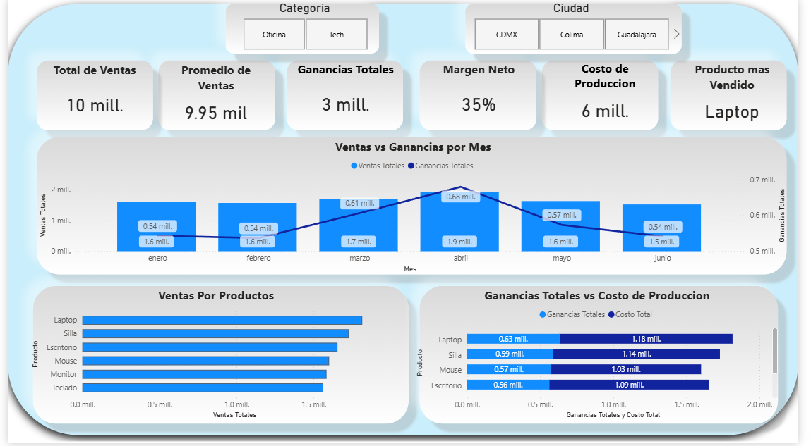

# 📊 Dashboard de Ventas - Power BI

Proyecto de Business Intelligence enfocado en el análisis de ventas, costos y rentabilidad para una persona moral.

## 🎯 Objetivo
Analizar el comportamiento de ventas y ganancias para apoyar la toma de decisiones mediante visualización de datos.

## 🛠️ Herramientas
- Power BI
- Power Query
- DAX
- Excel

## 📈 KPIs
- Total de ventas
- Ganancia total
- Margen neto (%)
- Costo de producción

## 📊 Visualizaciones
- Tendencia de ventas vs ganancia por mes
- Ventas por producto
- Comparativa de costos y ganancias
- Filtros por categoría y ciudad

## 🧠 Análisis realizado
- Identificación de productos con mayor volumen de ventas
- Evaluación de rentabilidad por periodo
- Segmentación de datos por ubicación y categoría

## 📷 Dashboard

